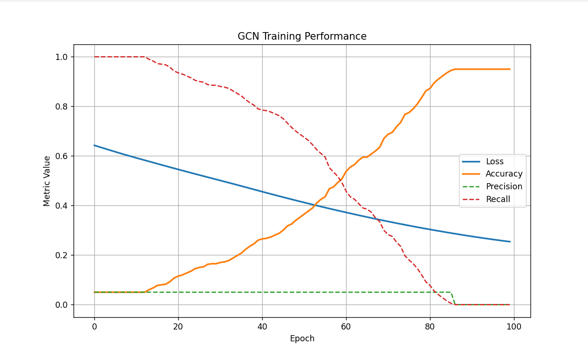

# Graph Neural Network Neuron Connectivity Onboarding Project

## Setup
An nxn, 2-d generated topographical map with p peaks is generated. Using this generated grid, noisy humidity graphs are generated. Also, node edges are generated representing signed height differences, which connect every coordinate point on the grid to its 4 neighbors. Following this, the task is to **predict the original peaks** of the graph using the noisy humidity representations, generated edge costs, and graph neural network classifiers.

## Implementation
Following the generation of the entire 2-D graph, our classification and message passing algorithm utilized a 3-layer graph convolutional neural network, that outputed a single node representing the classification of peak or not peak. After each layer, leaky ReLu activation functions were implemented in order to not completely zero out gradients. After this, a simple binary cross entropy loss function was utilized to train the network.
## Parameter Justifications and Findings

Due to the overall sparseness of peaks in the 2-D grid and the variance of the standard gaussian noise, identification of peaks was a noisy task. For this reason, the model often converged upon always guessing non-peak nodes. A variety of methods were instilled to stop this. Recall and precision were found to be effective ways of understanding if the model was always guessing the same thing. 

After trying to implement specific recall bias and other loss function changes, the best solution was found to be a combination of early stopping and tresholding for early prediction.
A graph of the loss curve over epochs can be seen below

Visually, as the model learns it converges upon a solution of always guessing non-peak classification. However, it somewhat linearlly learns this boundary. For this reason, early stopping is usually instilled around the 200 epoch mark. 

Furthermore, for testing, in order to ensure non 0 precision/recall a lower threshold was used to classify peaks (more peak classification). This lowered the overall accuracy of the tests but increased recall and precision, which may be important in certain tasks. Depending on the consequences of guessing peaks incorrectly, the threshold can be changed accordingly. For example, without thresholding or early stopping, test precision and test recall was found to be 0.0 and 0.0, as the model is never guessing that points are peaks at all.

However, after using thresholding and early-stopping, a test precision of ~30% and recall of 47% was achieved. While with a worse overall accuracy, this thresholding allows a balance between peak and non-peak prediction.

A learning rate of 0.001 using a simple Adam optimizer was found to be the most stable form of training. Higher learning rates resulted in random spikes in recall and precision curves. Furthermore, a small weight decay of 5e-3 was somewhat useful in preventing the weights from completely overfitting the data, along with small internal message passing feature representations, forcing the model to somewhat generalize.